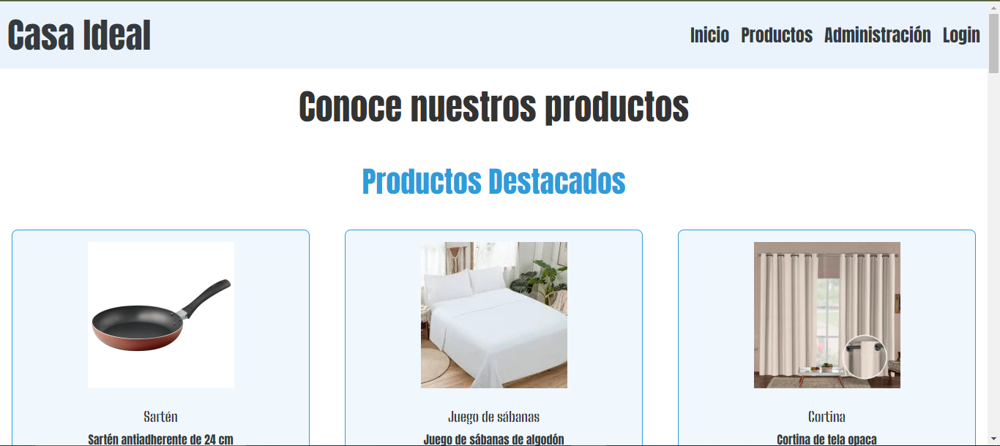
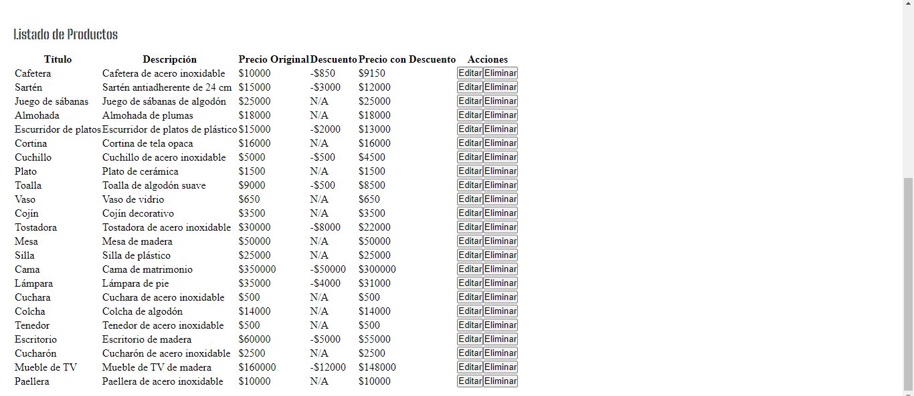
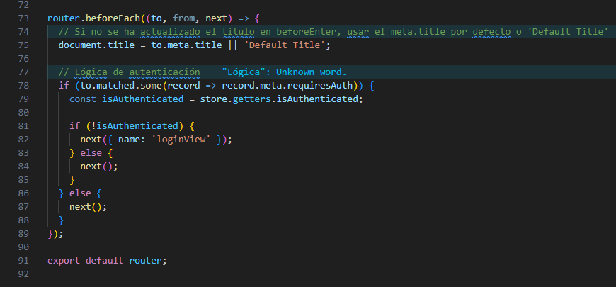
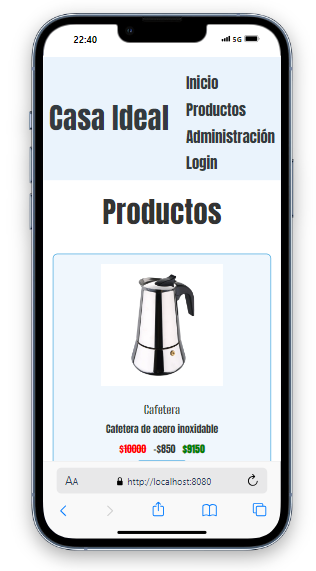

# Casa Ideal

## Descripción

Este proyecto es una aplicación de gestión de productos construida con Vue.js. Permite a los administradores agregar, editar y eliminar productos, así como ver los detalles de cada uno. Además, incluye funcionalidades de autenticación y visualización condicional del pie de página basado en el scroll.




## Estructura del Proyecto

### Vistas

- **AdminView.vue**: Panel de administración para gestionar productos.
  - Formulario para agregar productos: Permite a los administradores ingresar detalles de nuevos productos.
  - Listado de productos: Muestra una tabla con todos los productos existentes y opciones para editarlos o eliminarlos.
  - Modal de edición: Permite editar los detalles de un producto existente.



- **DetailProductView.vue**: Muestra los detalles de un producto específico.
  - Incluye la imagen del producto, categoría, descripción, stock y precios originales y con descuento.

- **ProductView.vue**: Vista principal que muestra una lista de productos.
  - Cada producto se muestra como un enlace que lleva a la vista de detalles del producto.
  - Controla la visibilidad del footer basado en la posición del scroll.

- **HomeView.vue**: Página de inicio que muestra productos destacados y en oferta.

- **LoginView.vue**: Página de inicio de sesión para los usuarios y administradores.

- **NotFoundView.vue**: Página que muestra un mensaje de error 404 para rutas no encontradas.

### Componentes

- **CardProduct.vue**: Componente que muestra una tarjeta de producto con información básica.
- **FooterLink.vue**: Componente de pie de página que se muestra en la vista de productos si la bandera `showFooter` es verdadera.
- **HeaderPage.vue**: Componente que muestra el título de la página basado en las propiedades `meta` de la ruta.
- **NavbarMenu.vue**: Componente de barra de navegación con enlaces a las distintas vistas.

## Credenciales y uso 
1. Descarga Node :

    ```bash
    npm install
    ```

2. Inicia el servidor de desarrollo:

    ```bash
    npm run serve
    ```

3. Credenciales de Usuario admin:

    ``` 
    correo: admin1@mail.com 
    password: 123456
    ```
4. Credenciales de Usuario:

    ``` 
    correo: marta.figueroao@mail.com 
    password: 123456
    ```

## Funcionalidades

### Administración de Productos

- Agregar nuevos productos con título, descripción, precio, descuento y URL de imagen.
- Editar productos existentes.
- Eliminar productos.

### Visualización de Productos

- Muestra una lista de productos con información básica.
- Permite a los usuarios acceder a los detalles de cada producto.

### Detalles del Producto

- Muestra información detallada sobre un producto específico, incluyendo imagen, categoría, descripción, stock y precios.

### Autenticación

- Permite a los administradores iniciar sesión para acceder al panel de administración.

## Diseño del Código

### Vuex Store

#### Estado Global

- Maneja el estado de los productos.
- Administra el token de autenticación y el usuario actual.

#### Mutaciones

- `SET_PRODUCTS`: Actualiza la lista de productos en el estado global.
- `SET_AUTH_TOKEN`: Establece el token de autenticación y el usuario actual.
- `LOGOUT`: Elimina el token de autenticación y el usuario actual.

#### Acciones

- `fetchProducts`: Obtiene la lista de productos desde la API.
- `login`: Maneja el proceso de inicio de sesión.

### Vue Router

#### Rutas

- `/`: Vista principal (HomeView).
- `/login`: Página de inicio de sesión (LoginView).
- `/product`: Vista de productos (ProductView).
- `/product/:id`: Vista de detalles del producto (DetailProductView).


- `/admin`: Panel de administración (AdminView).
- `*`: Página 404 (NotFoundView).

#### Meta Información

- Cada ruta tiene propiedades `meta` para definir el título de la página y requisitos de autenticación.


## Estilo y Metodología

### CSS

- Utiliza Bootstrap para estilos y Flexbox para el diseño de la página responsiva.



- Sigue la metodología BEM para nombrar clases.

### Comentarios en el Código

- Los comentarios están añadidos para proporcionar claridad sobre la funcionalidad y la lógica del código.

## Contribución

Si deseas contribuir a este proyecto, sigue estos pasos:

1. Realiza un fork del repositorio.
2. Crea una nueva rama para tus cambios.
3. Realiza un pull request detallando los cambios que has realizado.

## Contacto

Para preguntas, por favor contacta a `mcsaavedra23@gmail.com`.


